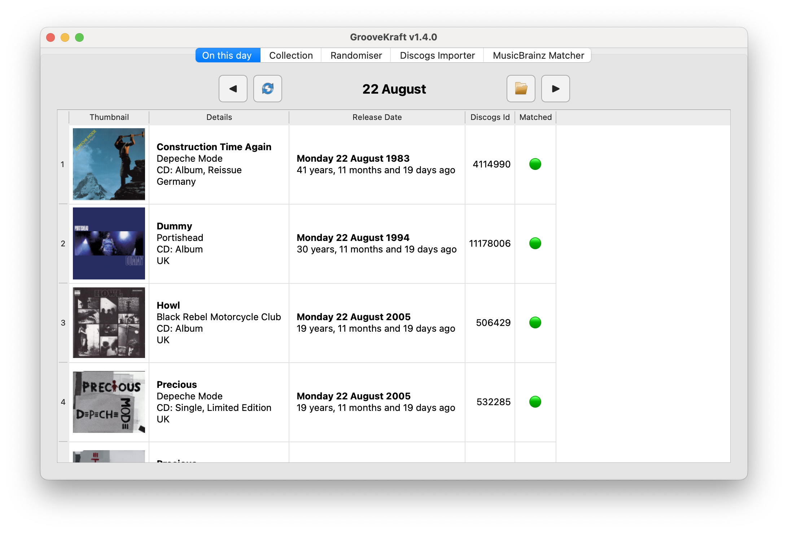
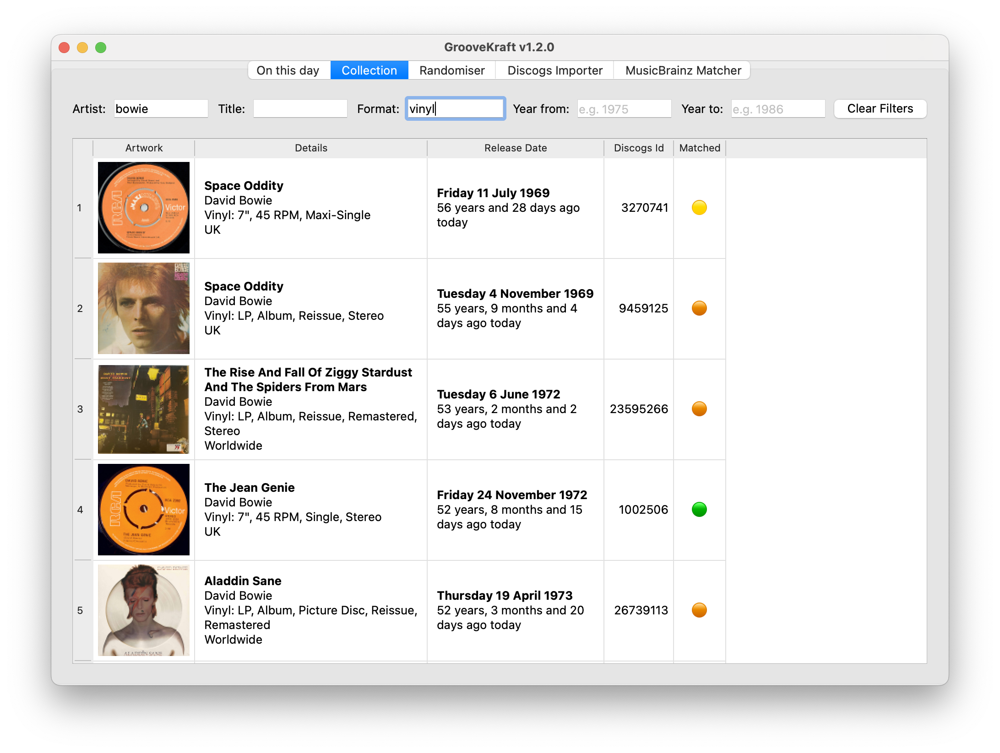
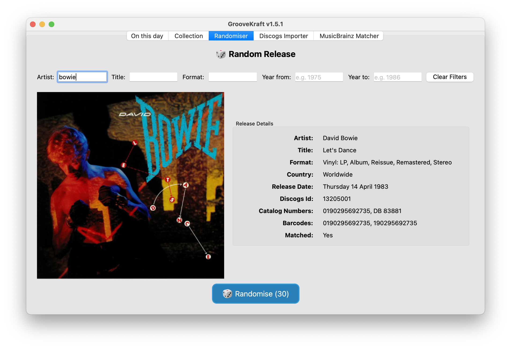

# GrooveKraft

**GrooveKraft** is a fast, lightweight music collection manager that uses Discogs and MusicBrainz to enrich your collection with detailed metadata and artwork.

Note: it's a work in progress, and subject to change.

## Features

- Import your Discogs collection into a local database
- View and filter your Discogs collection locally, with artwork
- Matches releases with MusicBrainz automatically to get release dates
- "On this day" function shows anniversaries in your collection
- Randomizer to help you pick something to listen to
- Missing or incorrect release dates can be manually entered
- Match quality shown with traffic-light icons (Red, Amber, Yellow, Green)

### On This Day



This shows anniversaries in your collection.

### Collection



This displays items in your collection. You can filter by several fields.

### Random Release



This displays a random item from your collection. Give it a listen!

## Operation

To import a collection from Discogs, run the Discogs Importer. The first time, you will be asked to authorise an OAuth token. The Discogs importer
is lightweight, but the API is rate-limited, and sometimes (rarely) it can encounter random errors. If that happens, simply re-running the import
should fix it. On the first import, the primary artwork will be downloaded from Discogs and saved locally. At a guess it takes about 10 minutes
to import 1,000 items. After the first time, the credentials will be re-used, but a new token is needed whenever the app version changes.

Next, the collection needs to be matched in MusicBrainz. You will be prompted for a MusicBrainz username and password the first time.
The matching process has various strategies to try to find the same release in MusicBrainz, but some things just don't exist.
The success rate is still high. Most releases can be matched exactly, because MusicBrainz releases can have a link to a Discogs release.
Where there is no such link, fuzzy matching is used to improve matches on artist, title, format and country. The match success score is shown
in the collection viewer using a traffic light system of Red, Amber, Yellow, Green, which indicate increasing confidence from Red (no match)
through to Green (perfect match).

The MusicBrainz matcher only processes items which have been updated since it was last run. The first run therefore, will be
quite slow, since everything will be processed. But after that, it will be much quicker, since most items won't have changed.

Once these steps are complete, 'On This Day' and the collection browser should be operational.

## Updating the collection

At a later date, say when collection items have been added, you should re-run the Discogs importer. Although there's no way of only importing changes, the import is quite fast (subject to Discogs API rate limiting) and most items will not have changed. The artwork won't need to be fetched if it hasn't changed.

Whenever the importer is run, the MusicBrainz matcher should be run afterwards. By default, the MusicBrainz matcher only updates items which didn't match last time, or have changed since the last match (because something changed in the Discogs metadata for the release). So it should be relatively fast.

## Release Dates

Release dates are an important part of the application. A summary of how they are derived and how they can be overridden is as follows:

- Release dates can be a full date (most releases), a month and year (a small percentage), or just a year (rare).
- The initial import will set the release date from Discogs. It may be just a year, or a month and year.
- The MusicBrainz match will attempt to match each Discogs release with a MusicBrainz release, which will contain a release date.
- Release dates can be manually entered by double clicking on the cell in the collection viewer. The release date field can be locked to prevent overwrites.
- Release dates are set from the master release, so it doesn't matter if you have a re-issue or re-release.

As well as Discogs and MusicBrainz, you may find other sources of release dates at:

- Wikipedia
- 45worlds.com
- Social media posts
- Discogs release web page

When release dates are manually entered, they can be protected against automatic updates by setting the lock.

Release dates are worth setting manually where they are missing. Otherwise, On This Day won't be as effective.

## Requirements

### Core Requirements

- Discogs account with a collection entered
- MusicBrainz account

### Simple Installation

To run as a packaged app on a Mac, just download the .dmg file. Double click it and drag the application to Applications.

### Optional for Building macOS App Bundle

- macOS (tested)
- Conda virtual environment (recommended)
- `pyinstaller` installed (`pip install pyinstaller`)
- `sips` and `iconutil` (macOS built-in utilities)

The mac-specific parts are only used to build the distribution .dmg and the icon set. Most of the code should be platform-agnostic. Running from source should work on any platform.

If you can contribute to make it truly multi-platform, contributions are welcome.

## Installation

### Install from source

1. Clone the repository:

```bash
git clone https://github.com/v8oholic/groovekraft.git
cd groovekraft
```

2. If using conda (recommended), create an environment using
```bash
conda env create -f environment.yml
conda activate groovekraft
```

### Install from app bundle

Double click GrooveKraft.dmg
Drag the application to Applications


## Building the App

To build GrooveKraft into a standalone macOS application:

```bash
conda activate groovekraft
./make_install.sh
```

This ensures all resources like icons and additional files are properly bundled. and creates a `.dmg` file.

## Usage

To run from source, run the app from the command line:

```bash
cd /path/to/app
conda activate groovekraft
python groovekraft.py
```

To run from the bundled app (if built with PyInstaller):

```bash
cd /path/to/app
open dist/GrooveKraft.app
```

To install from app bundle:

Double click GrooveKraft.dmg
Drag the application to Applications


## License

This project is licensed under the MIT License.